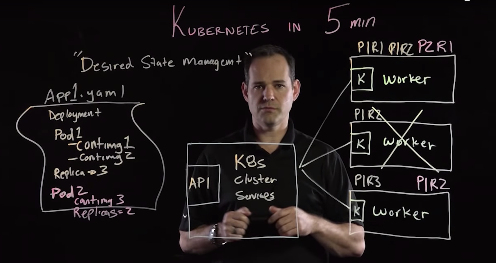

# basics

general
* [Concepts](https://kubernetes.io/docs/concepts/)
  * maintain cluster’s desired state
  * what application want to run
  * what container images to use
  * number of replicas
  * network
  * disk
  * application configuration
  * reverse proxy
  * deployment type
  
* [Objects](https://medium.com/google-cloud/kubernetes-101-pods-nodes-containers-and-clusters-c1509e409e16)
  * Container
  * Pod
  * service
  * ingress
  * volume
  * namespace
  * deployment
  * DaemonSet
  * StatefulSet
  * ReplicaSet
  * Job
  * configmap
  * secrets
* [Tools](https://kubernetes.io/docs/reference/tools/)
  * Kubectl
  * Minikube
  * Dashboard
  * Helm
  * Kompose
  * kubetail

  